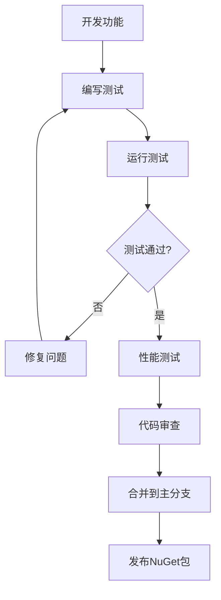

# AxolotlMCP

一个基于.NET 8和.NET 9的Model Context Protocol (MCP) 实现，类似于FastMCP但专为.NET生态系统设计。

## 项目结构概览

### 完整目录结构图

```
AxolotlMCP/
├── 📁 src/                                    # 源代码根目录
│   ├── 📁 AxolotlMCP.Core/                   # 核心协议与抽象层
│   │   ├── 📄 AxolotlMCP.Core.csproj         # Core 项目文件 (net8.0/net9.0)
│   │   ├── 📄 GlobalUsing.cs                 # 全局 using 汇总
│   │   ├── 📁 Protocol/                      # MCP 协议数据结构
│   │   │   ├── 📁 Message/                   # 协议消息模型
│   │   │   │   ├── 📄 McpMessage.cs
│   │   │   │   ├── 📄 McpError.cs
│   │   │   │   ├── 📄 RequestMessage.cs
│   │   │   │   ├── 📄 ResponseMessage.cs
│   │   │   │   └── 📄 NotificationMessage.cs
│   │   │   ├── 📄 JsonSchema.cs
│   │   │   ├── 📄 McpTool.cs
│   │   │   ├── 📄 McpResource.cs
│   │   │   └── 📄 McpPrompt.cs
│   │   └── 📁 Interfaces/                    # 核心接口定义
│   │       └── 📄 IMcpHandler.cs             # 处理器/服务器/客户端接口
│   ├── 📁 AxolotlMCP.Server/                 # 服务器实现层
│   │   └── 📄 AxolotlMCP.Server.csproj       # Server 项目文件
│   └── 📁 AxolotlMCP.Client/                 # 客户端实现层
│       └── 📄 AxolotlMCP.Client.csproj       # Client 项目文件
├── 📁 examples/                              # 示例代码根目录
│   └── 📁 AxolotlMCP.Examples/               # 示例可执行项目
│       ├── 📄 AxolotlMCP.Examples.csproj     # 示例项目文件
│       └── 📁 SimpleServer/                  # 简单服务器示例
│           └── 📄 SimpleServer.cs            # 示例代码实现
├── 📁 tests/                                 # 测试与基准根目录
│   ├── 📁 AxolotlMCP.Tests/                  # 单元测试项目
│   │   └── 📄 AxolotlMCP.Tests.csproj        # 测试项目文件 (xUnit)
│   └── 📁 AxolotlMCP.Benchmarks/             # 基准测试项目
│       └── 📄 AxolotlMCP.Benchmarks.csproj   # 基准项目文件 (BenchmarkDotNet)
├── 📁 docs/                                  # 文档目录
│   └── 📄 ARCHITECTURE.md                    # 架构设计说明
├── 📁 samples/                               # 配置与示例数据
│   └── 📄 simple-server.json                 # 简单服务器配置示例
├── 📁 tools/                                 # 工具脚本
│   └── 📄 build.ps1                          # 构建/测试/打包脚本
├── 📄 AxolotlMCP.sln                         # 解决方案文件
├── 📄 Directory.Build.props                  # 统一构建属性
├── 📄 .gitignore                             # Git 忽略规则
└── 📄 README.md                              # 项目说明文档
```

### 项目依赖关系图

```
┌─────────────────────────────────────────────────────────────┐
│                    AxolotlMCP.sln                          │
│                    解决方案文件                              │
└─────────────────────────────────────────────────────────────┘
                                │
                ┌───────────────┼───────────────┐
                │               │               │
        ┌───────▼───────┐ ┌─────▼─────┐ ┌───────▼───────┐
        │ AxolotlMCP.Core │ │ AxolotlMCP │ │ AxolotlMCP   │
        │    (核心层)     │ │  Server    │ │   Client     │
        │                │ │  (服务器)   │ │  (客户端)     │
        └────────────────┘ └─────────────┘ └───────────────┘
                │               │               │
                └───────────────┼───────────────┘
                                │
                ┌───────────────▼───────────────┐
                │      AxolotlMCP.Examples      │
                │         (示例项目)             │
                └───────────────────────────────┘
                                │
                ┌───────────────▼───────────────┐
                │        AxolotlMCP.Tests       │
                │         (单元测试)             │
                └───────────────────────────────┘
                                │
                ┌───────────────▼───────────────┐
                │     AxolotlMCP.Benchmarks     │
                │         (性能测试)             │
                └───────────────────────────────┘
```

### 模块职责边界

#### 🏗️ 核心层 (AxolotlMCP.Core)
- **职责**: MCP协议基础实现、数据结构定义、接口抽象
- **包含**: 消息类型、数据类型、核心接口
- **依赖**: 无内部依赖，仅依赖.NET基础库

#### 🖥️ 服务器层 (AxolotlMCP.Server)
- **职责**: MCP服务器实现、消息路由、工具管理
- **包含**: 服务器实现、中间件支持、工具注册
- **依赖**: 依赖Core层

#### 💻 客户端层 (AxolotlMCP.Client)
- **职责**: MCP客户端实现、连接管理、请求处理
- **包含**: 客户端实现、连接池、请求/响应处理
- **依赖**: 依赖Core层

#### 📚 示例层 (AxolotlMCP.Examples)
- **职责**: 展示框架使用方法、最佳实践
- **包含**: 简单服务器示例、使用场景演示
- **依赖**: 依赖所有核心层

#### 🧪 测试层 (AxolotlMCP.Tests + Benchmarks)
- **职责**: 质量保证、性能验证
- **包含**: 单元测试、集成测试、性能基准
- **依赖**: 依赖所有核心层

### 技术栈说明

| 组件 | 技术栈 | 说明 |
|------|--------|------|
| **目标框架** | .NET 8.0 / .NET 9.0 | 多目标框架支持 |
| **序列化** | System.Text.Json | 高性能JSON序列化 |
| **依赖注入** | Microsoft.Extensions.DI | 内置DI容器 |
| **日志记录** | Microsoft.Extensions.Logging | 结构化日志 |
| **测试框架** | xUnit + FluentAssertions | 单元测试 |
| **性能测试** | BenchmarkDotNet | 性能基准测试 |
| **构建工具** | .NET CLI + PowerShell | 跨平台构建 |

### 开发工作流



### 文件命名规范

- **项目文件**: `AxolotlMCP.{模块名}.csproj`
- **源代码文件**: `PascalCase.cs`
- **接口文件**: `I{接口名}.cs`
- **测试文件**: `{类名}Tests.cs`
- **配置文件**: `kebab-case.json`
- **脚本文件**: `kebab-case.ps1`

## 特性

- 🚀 **高性能**: 基于.NET 8/9的最新特性
- 🔧 **易于使用**: 简单的API设计
- 🛠️ **可扩展**: 支持自定义处理器和中间件
- 📦 **NuGet包**: 支持包管理器安装
- 🧪 **完整测试**: 包含单元测试和性能测试
- 📚 **丰富文档**: 详细的API文档和示例

## 快速开始

### 安装

```bash
dotnet add package AxolotlMCP.Core
dotnet add package AxolotlMCP.Server
dotnet add package AxolotlMCP.Client
```

### 创建简单服务器

```csharp
using AxolotlMCP.Core.Interfaces;
using AxolotlMCP.Core.Protocol;

public class MyMcpHandler : IMcpHandler
{
    public async Task<ResponseMessage> HandleRequestAsync(RequestMessage request, CancellationToken cancellationToken = default)
    {
        // 处理MCP请求
        return new ResponseMessage { /* ... */ };
    }

    public Task HandleNotificationAsync(NotificationMessage notification, CancellationToken cancellationToken = default)
    {
        // 处理MCP通知
        return Task.CompletedTask;
    }

    public string[] GetSupportedMethods()
    {
        return new[] { "initialize", "tools/list" };
    }
}
```

## 开发

### 构建项目

```bash
dotnet build
```

### 运行测试

```bash
dotnet test
```

### 运行示例

```bash
dotnet run --project examples/AxolotlMCP.Examples
```

## 许可证

MIT License

## 贡献

欢迎提交Issue和Pull Request！
